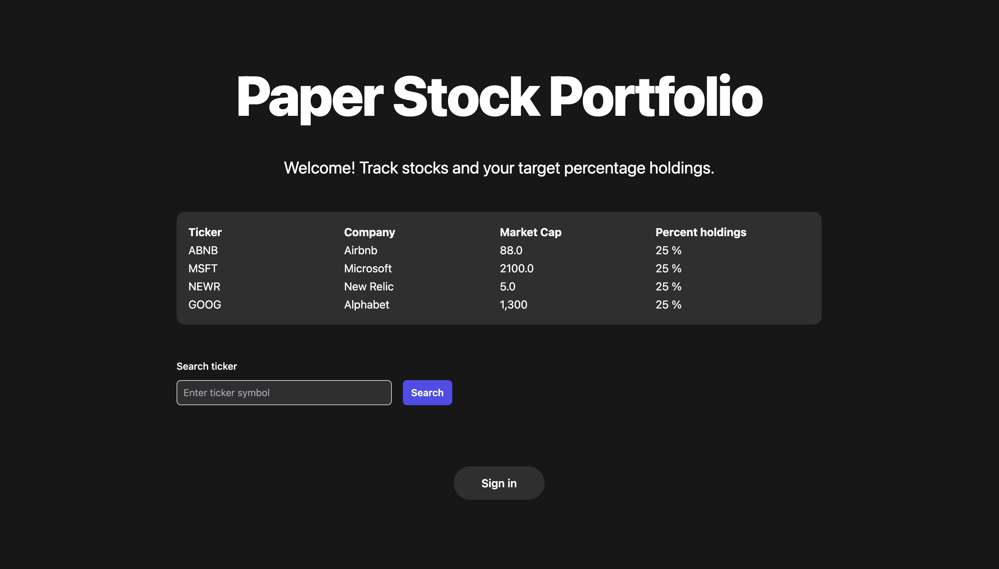

# Welcome to Paper Stock Portfolio
***

## Description
This project is a paper stock portfolio. It is built with:
1. TypeScript
2. Next.js
3. tRPC
4. Prisma
5. Tailwind CSS

## Installation
1. To access a copy of the project and run it on your local machine, clone the project: `git clone https://github.com/Ranada/paper_stock_portfolio.git`
2. Install project dependencies: `npm install`
3. Start the server: `npm run dev`
4. Open the project in browser: http://localhost:3000/

## Usage
- Open a deployed version of the project in Vercel using the following URL: https://paper-stock-portfolio.vercel.app/

- The app features to interact with the database are in progress. In the meantime, you can interact with the database by: 
1. Starting the Prisma Studio visual editor in terminal using `npx prisma studio`
2. Open Prisma Studio in the browser: http://localhost:5555

## Notes
- This is an ongoing project, and gradually rolling out features
- For now, the paper stock portfolio is based on using percentage allocation, which is what I've observed other people in an investment club that I am a member of use
- Next features will involve having a starting amount of money and then making notional purchases based on stock price

## Have recommendations? Want to chat about programming and other good stuff? Let's connect.
neil.ranada@gmail.com  
https://www.linkedin.com/in/neilranada/

### The Core Team
Neil Ranada, Software Engineer
